# Cluster Suite Overview

This "how to" uses CentOS's version of Red Hat Cluster Suite. I assume that it works the "same" on RHEL 6

A few things you need

*  A floating IP address (and IP that will move from one node to another)

*  Shared Storage (we are using iscsi in this use case)

*  2 Nodes for the cluster (running ` ricci `)

*  1 "management" node (running ` luci `)

This diagram should help with the "overview"

I did all of this with RHEV; but it can easily been done with KVM/VMWare/VirtualBox

The following resources for this use case

*  chrish.sbx.4over.com - Management Server running luci

*  w1.gln.4over.com - cluster node running ricci

*  w2.gln.4over.com - cluster node running ricci

*  Floating IP of 192.168.3.166 with ` web.gln.4over.com ` DNS pointing to it

*  Shared iscsi storage

If you need an iscsi how to click [here](iscsi_notes)\\
If you need network bonding how to click [here](nic_bonding_notes)

# Apache Web Cluster

Basic Web Cluster configuration

## Shared Storage

After you've set up your [nic bonding](nic_bonding_notes) and have logged into the [iscsi initiator](iscsi_notes) - you'll need for format the device from one of the nodes.

I didn't use LVM...I don't know if this will work with LVM so I just did it "raw" with FDSIK. Partition table should look like this

	
	[root@w1.gln.4over.com ~]# fdisk -l /dev/sda                  
	                                                                                                           
	Disk /dev/sda: 10.7 GB, 10733223936 bytes
	64 heads, 32 sectors/track, 10236 cylinders
	Units = cylinders of 2048 * 512 = 1048576 bytes
	Sector size (logical/physical): 512 bytes / 512 bytes
	I/O size (minimum/optimal): 512 bytes / 512 bytes
	Disk identifier: 0xf541e153
	                                                                                                                                                                                    
	Device Boot      Start         End      Blocks   Id  System
	/dev/sda1               1       10236    10481648   83  Linux

If you don't see the partition under ` /dev ` then use [partx](lvm_notes#re-read_partition_table) to make the kernel re-read the partition table.

Format the Drive on one of the nodes

	
	[root@w1.gln.4over.com ~]# mkfs.ext4 /dev/sda1

**__IMPORTANT:__** Do NOT mount this device on ANY of the nodes OR put it in FSTAB...we'll use the cluster suite for this

## Install Apache

Install the Apache web server on both nodes (also make sure that ssh is installed)

w1.gln.4over.com

	
	[root@w1.gln.4over.com ~]# yum -y groupinstall "Web Server"
	[root@w1.gln.4over.com ~]# yum -y install openssh-clients

w2.gln.4over.com

	
	[root@w2.gln.4over.com ~]# yum -y groupinstall "Web Server"
	[root@w2.gln.4over.com ~]# yum -y install openssh-clients

Make sure that apache does NOT start on boot (again this is controlled by the cluster suite)

w1.gln.4over.com

	
	[root@w1.gln.4over.com ~]# chkconfig httpd off

w2.gln.4over.com

	
	[root@w2.gln.4over.com ~]# chkconfig httpd off

## Install luci

Now install the luci cluster management application on the cluster server.

If you are using EPEL, you need to exclude some of the packages as there is a conflict.

	
	[root@chrish.sbx.4over.com ~]# yum install --disablerepo=epel* luci

Start luci and make sure that it starts on boot.

	
	[root@chrish.sbx.4over.com ~]# chkconfig luci on 
	[root@chrish.sbx.4over.com ~]# service luci start

This will start the service on port 8084 - `https://HOSTNAME:8084`

You login with the "root" account

## Install ricci

Now install ricci on each of the cluster nodes

w1.gln.4over.com

	
	[root@w1.gln.4over.com ~]# yum -y install ricci

w2.gln.4over.com

	
	[root@w2.gln.4over.com ~]# yum -y install ricci

Next start it and make sure it starts on boot.

w1.gln.4over.com

	
	[root@w1.gln.4over.com ~]# service ricci start
	[root@w1.gln.4over.com ~]# chkconfig ricci on

w2.gln.4over.com

	
	[root@w2.gln.4over.com ~]# service ricci start
	[root@w2.gln.4over.com ~]# chkconfig ricci on

The Cluster Managment (luci) interacts with the nodes via ssh - so you need to change the password on the ricci account on both nodes

w1.gln.4over.com

	
	[root@w1.gln.4over.com ~]# passwd ricci

w2.gln.4over.com

	
	[root@w2.gln.4over.com ~]# passwd ricci

## Create Cluster

Now, login to the luci web interface as root.

On the home screen - click "Manage Clusters" then click "Create"

Enter the following information

*  Name of the cluster: mycluster

*  Tick "Use the Same Password for All Nodes"

*  Add 2 nodes
    * w1.gln.4over.com (enter the ricci password)
    * w2.gln.4over.com (ricci password should be entered automatically)

*  Select "Download Packages"

*  Tick...
    * Reboot Nodes Before Joining Cluster
    * Enable Shared Storage Support

*  Click "Create Cluster"

The filled out window should look like this \\ \\
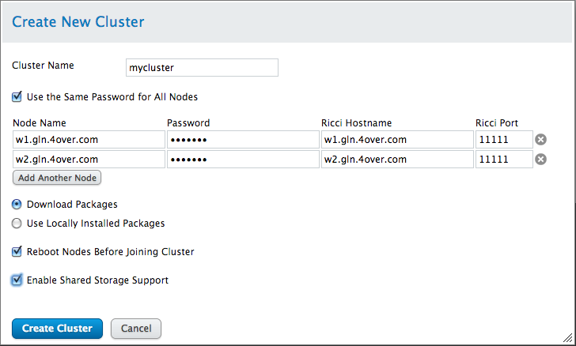

**__NOTE:__** You might run into a bug where one of the nodes comes up as "not available". Just scp the ` /etc/cluster/cluster.conf ` file to the "down" node and start/chkconfig ` cman ` then reboot.

## Assign Resources

You need to assign "resources" for you cluster. For the web server there are 3 main ones.

*  Floating IP address

*  Network Storage and Mountpoint

*  Service to monitor

Login to the luci web console as root and...

*  Click on "mycluster"

*  Click on "Resources"

*  Click "Add"

*  Select "IP Address" and enter
    * IP Address - 192.168.3.166
    * Netmask - (enter or leave blank for "default")
    * Monitor Link - checked
    * Disable Updates To Static Routes - Unchecked
    * Number of Seconds To Sleep... - 10

*  Click "Submit"

It should look something like this \\ \\
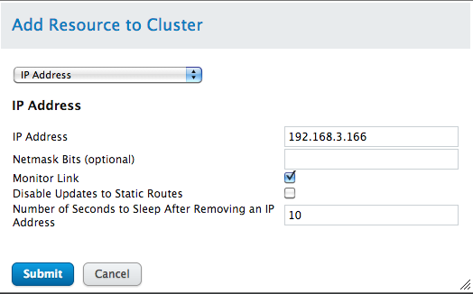

Add another resource

*  Click "Add"

*  Select "Filesystem" and enter
    * Name - webroot
    * Filesystem Type - ext4
    * Device - /dev/sda1 (the LUN shared between the two)
    * Mount Options - blank
    * Filesystem ID - blank
    * Force Unmount - ticked
    * Force FSCK - ticked
    * Use Quick Status Checks - ticked
    * Reboot Host Node if Unmount Fails

*  Click "Submit"

It should look like this \\ \\

Now add the httpd service as a resource...

*  Click "Add"

*  Select "script" and enter
    * Name - httpd
    * Full Path To Script - /etc/init.d/httpd

*  Click "Submit"

It should look like this \\ \\
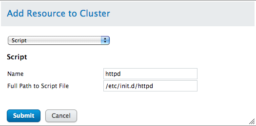

These are the minimal resources needed for this purpose.

## Create Failover Domain

A "Failover Domain" is a configuration that says where a service should be re-located to.

You can also configure if the service fails back once a node is back online.

On your "mycluster" config page - click on "Failover Domains" and click "Add"

Enter the following

*  Name - preferw1.gln

*  Prioritize - tick

*  Restricted - tick

*  No Failback - tick

*  node membership
    * w1.gln.4over.com - tick
    * w2.gln.4over.com - tick

It should look like this \\ \\
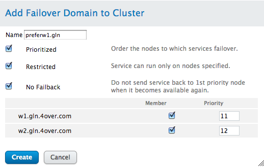

## Add Fencing

There are other errors that can cause a node to go "offline" other than a service crash.

For example, if a network interface card gives out. You need a way to "turn off" (i.e. fence) the device.

There are MANY fencing mechanism...since we are using KVM...we'll use the KVM fencing mechanism.

Click "Fence Device" then click "Add"

*  Select "Fence virt (multicast)

*  Name - KVMFencing

*  Click "Submit"

It should look like this \\ \\
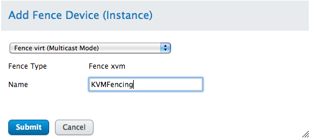

Now you need to "attach" the fencing mechanism to each node.

Under "mycluster" click on "Nodes" and click on each node and add the following in the confiuration pane

*  Click "Add Method"
    * Name - KVM_Method

*  Click Submit

*  Click "Add Fence Instance"
    * Select KVMFencing
    * List domain (i.e. for KVM it's what you get in ` virsh list `)

*  Click "Submit"

This is how the ` w1.gln.4over.com ` node should look like

This is how the ` w2.gln.4over.com ` node should look like

## Add Service Group

You will now add a service group - a service group is what service to move back and forth between nodes.

Click "Service Groups" and click on "Add"

*  Service Name - mywebcluster

*  Automatically Start This Service - tick

*  Run Exclusive - Tick

*  Failover Domain - select your failover domain rule (in this case "preferw1.gln")

*  Recovery Policy - relocate

*  Click "Submit"

This is what it should look like \\ \\

Now that you added your service group attach your resources.

Click on your service group and click on "Add Resource".

Add all of your resources

*  IP Address

*  File System

*  Script

When you are done adding the 3 - click submit.

You need to do them one at a time...the drop down provides your created resources "on top" \\ \\

## Testing

Find out what node this service is running on...

	
	[root@w1.gln.4over.com ~]# clustat
	Cluster Status for mycluster @ Thu Oct 10 22:18:59 2013
	Member Status: Quorate
	                                                                                                                                                                    
	 Member Name                                             ID   Status
	 ------ ----                                             ---- ------                                                                                                          
	 w1.gln.4over.com                                        1 Online, Local, rgmanager
	 w2.gln.4over.com                                        2 Online, rgmanager
	                                                                                                                                                                        
	 Service Name                               Owner (Last)                               State
	 ------- ----                               ----- ------                               -----                                            
	 service:mywebcluster                       w1.gln.4over.com                           started

It looks like ` w1.gln.4over.com  ` is running the web service...let's verify

	
	[root@w1.gln.4over.com ~]# df -h
	Filesystem            Size  Used Avail Use% Mounted on
	/dev/mapper/vg0-lv_root
	                       18G  1.2G   16G   8% /
	tmpfs                 499M   26M  474M   6% /dev/shm
	/dev/vda1             485M   52M  408M  12% /boot
	/dev/sda1             9.9G  151M  9.2G   2% /var/www/html
	[root@w1.gln.4over.com ~]# ip addr
	1: lo: `<LOOPBACK,UP,LOWER_UP>` mtu 16436 qdisc noqueue state UNKNOWN 
	    link/loopback 00:00:00:00:00:00 brd 00:00:00:00:00:00
	    inet 127.0.0.1/8 scope host lo
	    inet6 ::1/128 scope host 
	       valid_lft forever preferred_lft forever
	2: eth0: `<BROADCAST,MULTICAST,UP,LOWER_UP>` mtu 1500 qdisc pfifo_fast state UP qlen 1000
	    link/ether 00:1a:4a:a8:0b:dd brd ff:ff:ff:ff:ff:ff
	    inet 192.168.3.167/24 brd 192.168.3.255 scope global eth0
	    inet 192.168.3.166/24 scope global secondary eth0
	    inet6 fe80::21a:4aff:fea8:bdd/64 scope link 
	       valid_lft forever preferred_lft forever
	[root@w1.gln.4over.com ~]# curl web.gln.4over.com
	`<html>`
	`<h1>`
	  MY CLUSTER WORKS
	</h1
	`</html>`

So it looks like it's running on this server and it has the FS mounted and IP address is been added as a sub interface.

I'm going to "restart" this node and see if the service migrates.

Let's check node ` w2.gln.4over.com  ` 

	
	[root@w2.gln.4over.com ~]# clustat 
	Cluster Status for mycluster @ Thu Oct 10 22:34:51 2013
	Member Status: Quorate
	
	 Member Name                                                     ID   Status
	 ------ ----                                                     ---- ------
	 w1.gln.4over.com                                                    1 Online, rgmanager
	 w2.gln.4over.com                                                    2 Online, Local, rgmanager
	
	 Service Name                                                     Owner (Last)                                                     State         
	 ------- ----                                                     ----- ------                                                     -----         
	 service:mywebcluster                                             w2.gln.4over.com                                                 started       
	[root@w2.gln.4over.com ~]# df -h
	Filesystem            Size  Used Avail Use% Mounted on
	/dev/mapper/vg0-lv_root
	                       18G  1.2G   16G   7% /
	tmpfs                 499M   26M  474M   6% /dev/shm
	/dev/vda1             485M   52M  408M  12% /boot
	/dev/sda1             9.9G  151M  9.2G   2% /var/www/html
	[root@w2.gln.4over.com ~]# ip addr
	1: lo: `<LOOPBACK,UP,LOWER_UP>` mtu 16436 qdisc noqueue state UNKNOWN 
	    link/loopback 00:00:00:00:00:00 brd 00:00:00:00:00:00
	    inet 127.0.0.1/8 scope host lo
	    inet6 ::1/128 scope host 
	       valid_lft forever preferred_lft forever
	2: eth0: `<BROADCAST,MULTICAST,UP,LOWER_UP>` mtu 1500 qdisc pfifo_fast state UP qlen 1000
	    link/ether 00:1a:4a:a8:0b:6d brd ff:ff:ff:ff:ff:ff
	    inet 192.168.3.168/24 brd 192.168.3.255 scope global eth0
	    inet 192.168.3.166/24 scope global secondary eth0
	    inet6 fe80::21a:4aff:fea8:b6d/64 scope link 
	       valid_lft forever preferred_lft forever

The service is migrated.

# Misc Notes

__CMD Notes__
You can migrate via command line

	
	root@host# clusvcadm -r mywebcluster -m w2.gln.4over.com  

List cluster status from any node

	
	root@host# clustat 
	Cluster Status for mycluster @ Thu Oct 10 22:34:51 2013
	Member Status: Quorate
	
	 Member Name                                                     ID   Status
	 ------ ----                                                     ---- ------
	 w1.gln.4over.com                                                    1 Online, rgmanager
	 w2.gln.4over.com                                                    2 Online, Local, rgmanager
	
	 Service Name                                                     Owner (Last)                                                     State         
	 ------- ----                                                     ----- ------                                                     -----         
	 service:mywebcluster                                             w2.gln.4over.com                                                 started       

__RHEV Fencing__

Here are the parameters for the RHEV-M Fencing addon

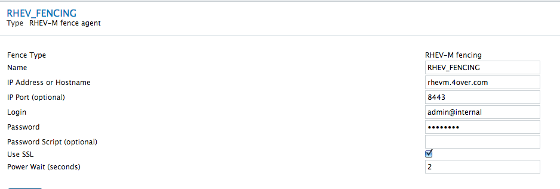

For more information about RHEVM Fencing; click [here](rhev-m_notes#misc_rhevm_notes)

# RHEL 7 Cluster Suite

Installation Help: [ CLICK HERE](https://access.redhat.com/solutions/45930)
## Introduction

In principal; the paradigm of clustering hasn't changed. You still have more than one node with a floating IP address and some sort of shared storage and management software. That much hasn't changed.

What has changed is the software. In RHEL 7 they introduced ` pacemaker ` and *corosync* as the clustering software replacing ` conga ` (I guess luci and ricci broke up :D )

The design looks like this:

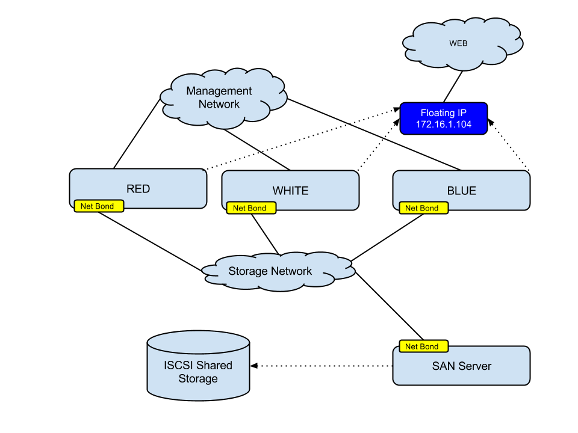

Notice that there is no longer a requirement for a "management" server. All nodes now are "peers" in this new design!

## Installation

There are a few things we are assuming before we get started

 1.  DNS is set up properly
 2.  Network Bond for the storage network (If you don't know look [HERE](nic_bonding_notes))
 3.  You'll need shared storage (You can set up a NAS [HERE](iscsi_notes#server_configuration) if you need a QnD how to)
 4.  You are registered with Red Hat to receive the proper channels (More info [HERE](rhn))

Install RHEL7 in a "minimal" configuration.

First (for LAB purposes ONLY...don't do this in production) - disable *SELinux* and *Firewall* for all nodes

	
	systemctl disable firewalld
	systemctl stop firewalld
	sed -i.bak 's/^SELINUX=.*/SELINUX=disabled/g' /etc/sysconfig/selinux
	setenforce 0

Now run *timedatectl* on all nodes to make sure time is synced up

	
	timedatectl status  

Now set up passwordless ssh by using *ssh-keygen* on all hosts

	
	root@NODE# ssh-keygen
	Generating public/private rsa key pair.
	Enter file in which to save the key (/root/.ssh/id_rsa):
	Created directory '/root/.ssh'.
	Enter passphrase (empty for no passphrase):
	Enter same passphrase again:
	Your identification has been saved in /root/.ssh/id_rsa.
	Your public key has been saved in /root/.ssh/id_rsa.pub.
	The key fingerprint is:
	e7:31:83:74:75:d1:62:12:78:69:7a:b5:c3:9a:41:fc root
	The key's randomart image is:                                                                                            
	+--[ RSA 2048]----+                                                                                                           
	|           ooooo |
	|          ..W.+ .|
	|        . .= * o |
	|       . o. e E  |
	|        S =. + . |
	|         o +e    |
	|          .      |
	|                 |
	|                 |
	+-----------------+

Once you've generated the keys on all hosts make sure you copy the keys to all nodes in the cluster (including itself!).

	
	for i in nas red white blue;  do ssh-copy-id $i; done 

Make sure you can ssh without passwords on all nodes (Make sure that you can log in via short and long hostname.)

	
	root@NODE# for i in nas red white blue;  do ssh $i hostname; done
	nas
	red
	white
	blue
	root@NODE#

Make sure you connect to the shared storage...pretty much the same as it is [HERE](iscsi_notes#client_configuration). Except you use *systemctl* to start/check the service.

Install the clustering software(s)

	
	yum -y install lvm2-cluster corosync pacemaker pcs fence-agents-all

*  *lvm2-cluster* provides cluster-aware logical volume capabilities

*  *corosync* and *pacemaker* (clustering software)

*  *pcs* is the pacemaker and corosync administration tool. It can be used from the command line, and it also provides pcsd, which exposes a webbased UI. We'll use the web UI

*  *fence-agents-all* provides fence agents for all supported fence devices

OR, you can use the "groupinstall" names

	
	yum groupinstall 'High Availability'
	yum groupinstall 'Resilient Storage'

Enable and start the pcsd service

	
	systemctl enable pcsd.service
	systemctl start pcsd.service

The clustering software uses the “hacluster” account for administration. Set this user's password across all the nodes:

	
	echo [password] | passwd --stdin hacluster

## Cluster Configuration

There are a few parts to this; some from the command line others from the WebUI

### Create Cluster

Authorize the nodes to be part of the cluster. THIS NEEDS TO BE RUN ON ALL NODES

	
	[root@white ~]# pcs cluster auth red white blue
	Username: hacluster            
	Password:                                    
	red: 544b6fd6-cf48-46d0-8e5c-be4387546e0c
	red: Authorized
	white: 9f2fe764-6cea-4c9f-ab4d-b546162f181a
	white: Authorized
	blue: 6c1d31ba-0bae-4d71-90c3-e1b40285ad20
	blue: Authorized

Set up the cluster after authorization (again any node in the cluster). Syntax here is ` pcs cluster setup --name [clustername] [node, node, node] ` You'll get a success msg from each node.

	
	pcs cluster setup --name web red.tld white.tld blue.tld

Make sure the service is running on all nodes (run from any node)

	
	pcs cluster start --all
	pcs cluster enable --all

Verify Corosync Installation
`corosync-cfgtool -s`

Verify Corosync Installation
`corosync-cmapctl | grep members`

Verify Corosync Installation
`crm_verify -L -V`

### Import Cluster

Connect via https to port 2224. Any system in the cluster can be used (no more single management node!).

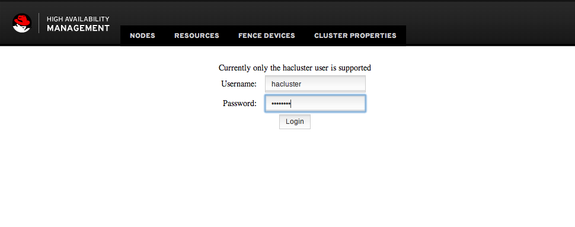

Click on "Add Existing" and enter one of the nodes in the cluster

You should see the name of your cluster and the members

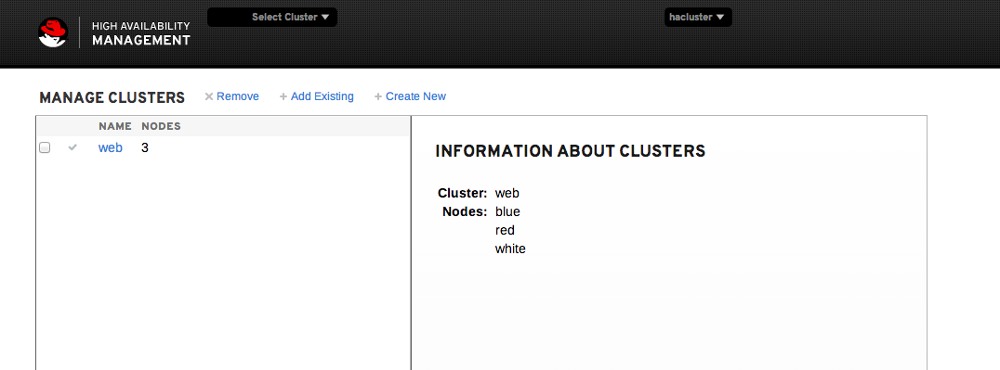

Navigate through and check each node. They should all have pacemaker, corosync, and pcsd running. It should look something like this

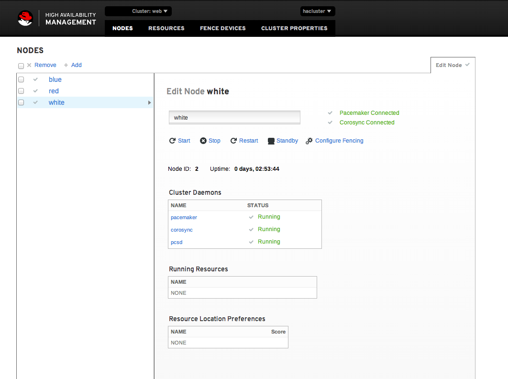

### Configure Fencing

If a node stops responding, the cluster will attempt to remove that node from the cluster. This is referred to as STONITH (Shoot The Other Node In The
Head). You're basically pulling the power from the system.

Click on 

*  Fencing Devices

*  Add

Select your fencing mechanism (in this case I'll user rhevm) and fill in the information. It should look like this

If all the information is correct; you should see a "running" in green.

Go into “Optional Arguments” to set the following extra settings. Add "host:port,host:port,host:port,host:port"
(NOTE: In RHEV, the "port" part is what the RHEV name OR UUID is of the server)

You may also want to set up the following "Optional" options

*  power_wait 5

*  delay 5

Test with *stonith_admin* 

	
	stonith_admin -I
	stonith_admin --reboot red

__IN THE END!__ It should look like this

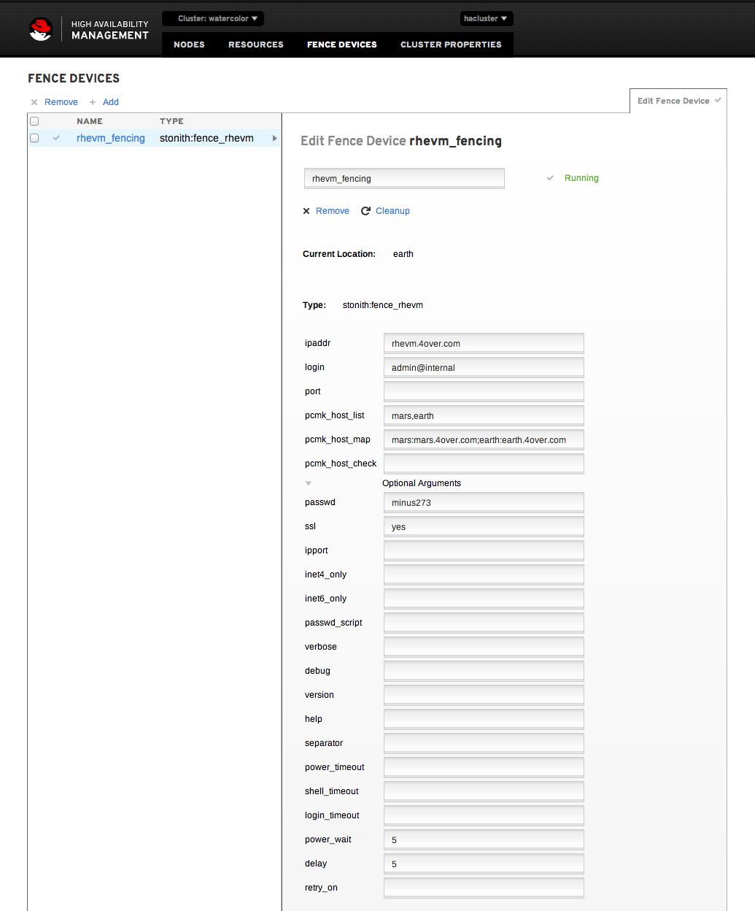

You can set up fencing from the command line like this.

	
	pcs stonith create rhevm_fencing fence_rhevm params ipaddr="rhevm.4over.com" login="admin@internal" passwd="minus273" pcmk_host_map="mars:mars.4over.com;earth:earth.4over.com" pcmk_host_list="mars,earth" power_wait="5" delay="5" ssl="yes" ssl_insecure="1"

Syntax for this is: *pcs stonith create ${give_it_a_name} ${type_of_fencing} params ${parameters} *

NOTE: Make sure that `pcmk_host_map` and `pcmk_host_list` are listed respectivley. I had the issue of fencing `earth` when I meant to fence `mars` because these two attributes were set incorrectly
### Configure Resources

The two resource we'll create is Apache and a floating IP address. You will need to be in the "Resources" tab for this

##### Floating IP

To Configure the floating IP address (Remember to be in the "Resources" tab)

*  Choose Add

*  Choose Open Cluster Framework (OCF) heartbeat Class/Provider

*  Choose IPaddr2 (this is new, and Linux specific, don't use the old IPaddr) type

*  Give it a Resource ID (friendly name)

*  Assign the IP address

*  Note that you get context-sensitive hover help!

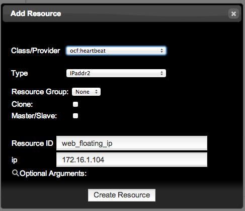

On one of the nodes...run the following to confirm

	
	pcs resource show

##### Apache

Install httpd and wget on all the nodes. Confirm that httpd is disabled - we want it started by the cluster software, not at boot time!

	
	yum -y install httpd
	systemctl disable httpd.service

Enable status checking on all httpd nodes

	
	cat > /etc/httpd/conf.d/status.conf << EOF
	`<Location /server-status>`
	SetHandler server-status
	Order deny,allow
	Deny from all
	Allow from 127.0.0.1
	`</Location>`
	EOF

Now on the WebUI configure the Apache service (In the resource tab)

*  Choose Add

*  Choose Open Cluster Framework (OCF) heartbeat Class/Provider

*  Choose the apache type

*  Give it a Resource ID (friendly name)

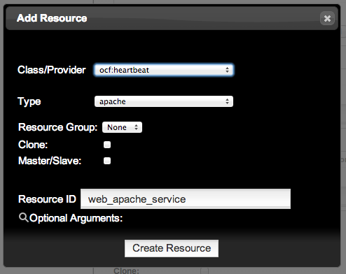

Now when you run *pcs status* you'll notice something not right

	
	 RHEV_FENCING   (stonith:fence_rhevm):  Started blue                                                                          
	 web_floating_ip        (ocf::heartbeat:IPaddr2):       Started red                                                                 
	 web_apache_service     (ocf::heartbeat:apache):        Started white 

You need to set it up to where the IP and service start on the same node. We need to set two resource features

*  Resource Ordering Preferences

*  Resource Colocation Preferences

To set up Resource Ordering Preferences (In the resource tab)

*  Choose the web_floating_ip resource

*  Go to Resource Ordering Preferences

*  Add in the resource summit-apache

*  Set web_apache_service to start after web_floating_ip

*  Click add

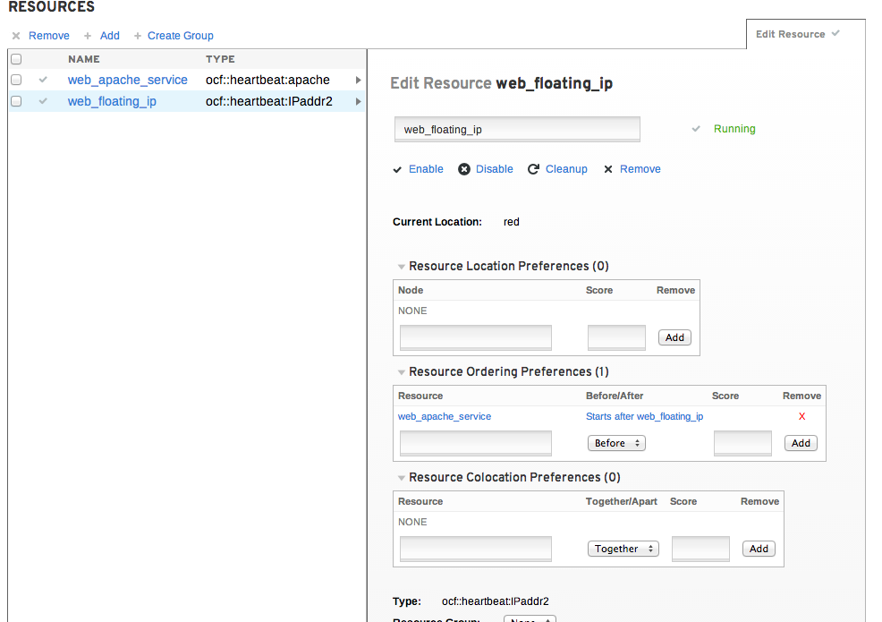

NOTE: Unfortunately the above didn't work on the Web UI...so I did it from the command line

	
	pcs constraint order start web_floating_ip then web_apache_service

Resource Colocation Preferences

*  Choose the web_apache_service resource

*  Choose Resource Colocation Preferences

*  Enter web_floating_ip and set it to start together with summit-apache

*  Click add

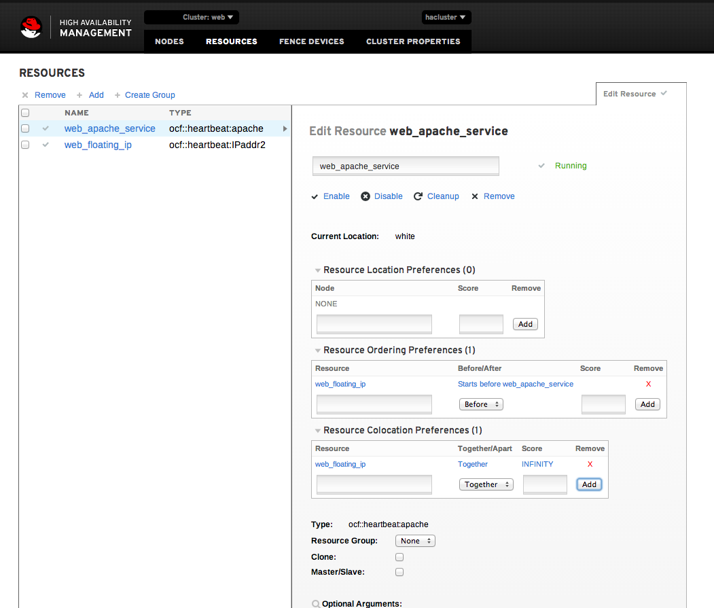

Now you should see the IP and Apache on the same node when doing a *pcs status*

	
	RHEV_FENCING   (stonith:fence_rhevm):  Started blue 
	 web_floating_ip        (ocf::heartbeat:IPaddr2):       Started red 
	 web_apache_service     (ocf::heartbeat:apache):        Started red 

Set up Apache Monitoring

*  Go into the web_apache_service resource and choose Optional Arguments

*  Because we set up monitoring, use the URL we defined - ` http://localhost/server-status ` - in the ` statusurl ` box

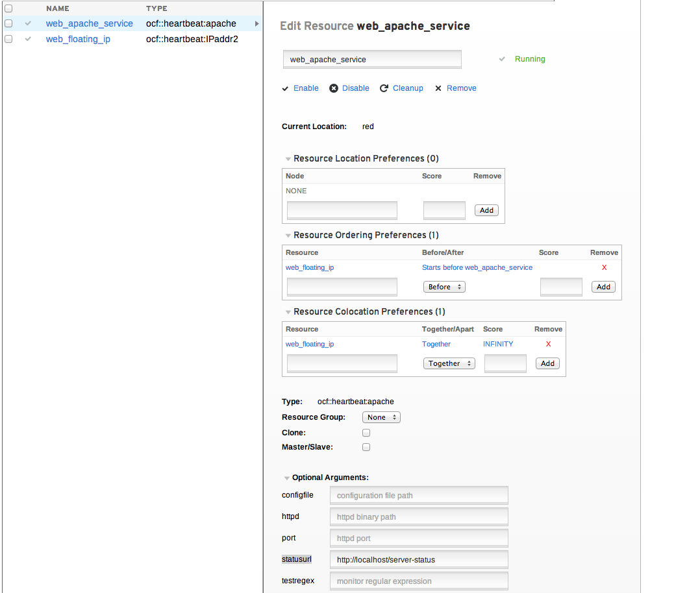

##### Resource Location Preferences

You can also set up host affinity via Resource Location Preferences. Add each of the hosts you want to run the service on and add a score. The higher the score, the more likely the service is to run on that node.

##### Host Control

You can ` stop, start, reboot ` a node on the "Nodes" tab. Note that a "reboot" does a *shutdown* command rather than a fence procedure.

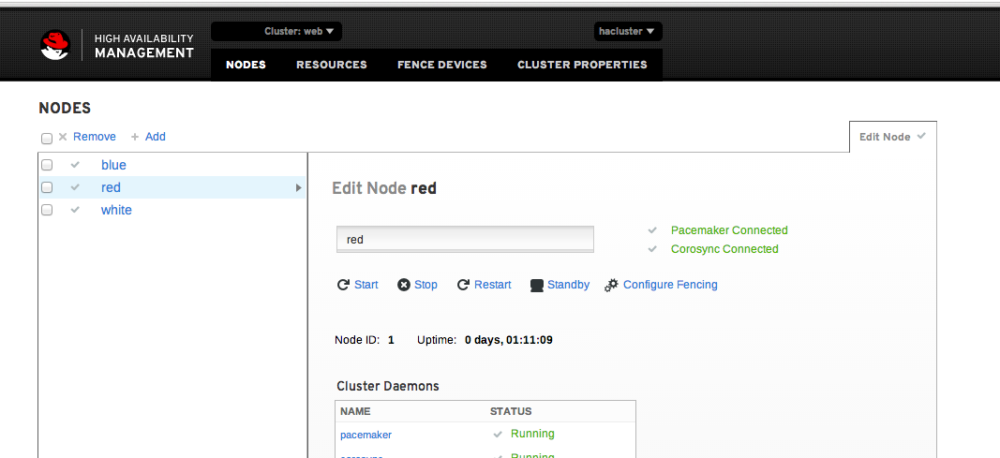

##### Enable distributed lock management

To configure a DLM resource...

*  Click on the Resource tab

*  Select ADD...

*  Create a new ` ocf:pacemaker ` class resource of ` controld `

*  Check the box for “clone” - we want this service cloned across all the nodes

*  Give it a Resource ID - in this case, ` web_dlm `

*  After a few seconds it should start and turn green

##### Configure Volume DLM

To Enable Clustered Logical Volume Management

*  Click on the Resource tab

*  Select ADD

*  Add an ` lsb` Class/Provider for *clvm*

*  Set it as cloned - we want this running on all nodes

*  Give it a Resource ID - in this case, *web_clvmd*

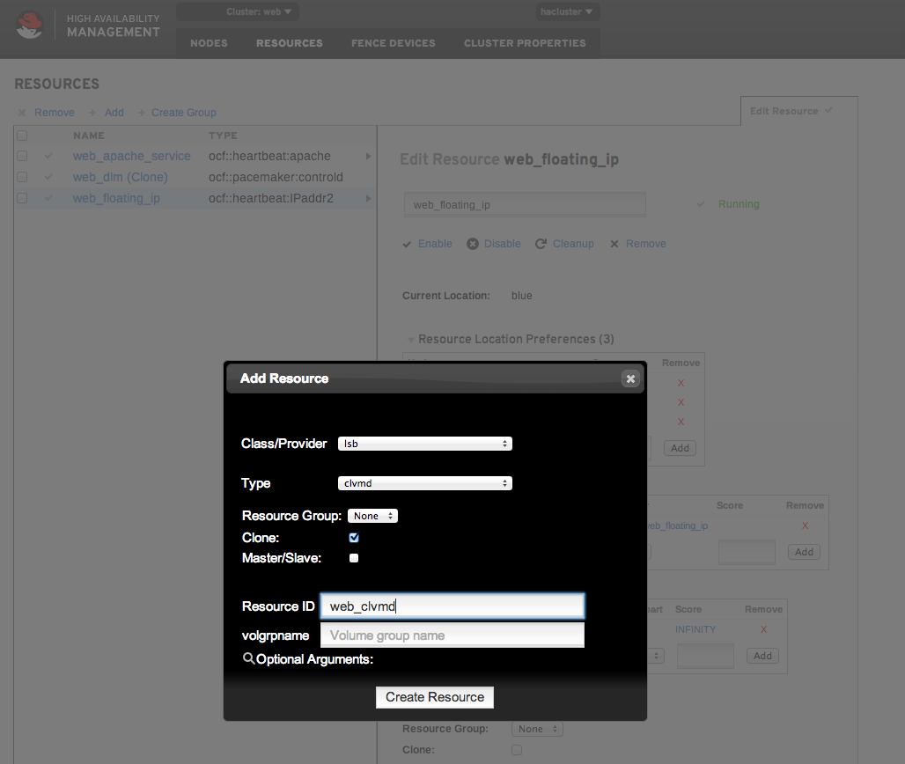

Again; the above didn't work so I had to do it from the command line (it shows up on the UI once this is ran).

First I ran this command on each node (Change `locking_type` from 1 to 3 in ` /etc/lvm/lvm.conf `

	
	lvmconf --enable-cluster

Then ran this on one of the nodes in the cluster.

	
	pcs resource create web_clvmd lsb:clvmd op monitor interval=10s on-fail=fence clone interleave=true clone-node-max=1 ordered=true

### Configure CLVM

First Change locking_type from 1 to 3 in ` /etc/lvm/lvm.conf ` on all the nodes.

	
	lvmconf --enable-cluster

From ` /etc/lvm/lvm.conf` Don't use *lvmetad* with locking type 3 as *lvmetad* is not yet supported in clustered environment. If *use_lvmetad=1* and *locking_type=3* is set at the same time, LVM always issues a warning message about this and then it automatically disables *lvmetad* use.

Change this on all nodes if ` grep "use_lvmetad = 1" /etc/lvm/lvm.conf ` returns...change it to 0 with

	
	perl -pi.orig -e 's/use_lvmetad = 1/use_lvmetad = 0/' /etc/lvm/lvm.conf

### Configure Shared Storage

This is done on the disk you connected to via iscsi. If you forgot how to login to an ISCSI target...you can find the info [HERE](iscsi_notes#client_configuration)

Create a filesystem on the shared storage (note the use of ` --clustered y ` option on the *vgcreate* command)

	
	pvcreate /dev/sdb 
	vgcreate --clustered y vg_web /dev/sdb
	lvcreate -l +100%FREE -n lv_web vg_web

You can use pvs, lvs and vgs to scan LVM components from the other nodes From each node, just run those commands:

	
	pvs
	vgs
	lvs

Once you run those on all nodes you should be able to see the shared storage from all the nodes.

Now install *gfs2-utils*

	
	yum -y install gfs2-utils

Now, Create a GFS2 Filesystem on the Clustered Logical Volume
`mkfs.gfs2 -j 3 -t web:gfs0 /dev/vg_web/lv_web `
Breaking this down...

*  *-j 3* is the number of journals - one per node. Extras are fine, too.

*  *-t summit:gfs0* is [clustername]:[fsname]. “web” is the name of the cluster we defined, and “gfs0” is the name I gave the filesystem being created.

*  ` /dev/vg_summit/lv_web ` is the block device being formatted. In this case, a clustered logical volume

Now we add the share storage as a resource.

*  Click Resource Tab

*  Click "Add"

*  Create a new *ofc:heartbeat* resource of type *Filesystem*

*  Check the box to clone the resource - we wanted it mounted on all the servers (since it's GFS2)

*  Give it a Resource ID - in this case, “web_gfs0”

*  Define the block device - in this case, the clustered logical volume “/dev/vg_web/lv_web”

*  Set mountpoint - in this case it's ` /var/www/html `

*  Define the filesystem type - in this case, *gfs2*

*  Click “Create Resource”

__Footnote__

Red Hat support suggested doing this (looks "faster" than doing it on web ui)

	
	Create dlm, clvm:
	----------------
		( edit lvm.conf to make locking_type=3 , can be made with
	         #lvmconf --enable-cluster)
	
		# pcs resource create dlm ocf:pacemaker:controld op monitor interval=10s on-fail=fence clone meta interleave=true clone-node-max=1 ordered=true 
	
		# pcs resource create clvmd lsb:clvmd op monitor interval=10s on-fail=fence clone interleave=true clone-node-max=1 ordered=true
		# pcs constraint order start dlm-clone then clvmd-clone
		# pcs constraint colocation add clvmd-clone with dlm-clone
	
	
	Creating clustered lvm volume for GFS2: (if required)
	--------------------------------------
		# pvcreate /dev/mapper/mpatha
		# vgcreate vg1 /dev/mapper/mpatha
		# lvcreate -L 500M -n lv1 vg1
	
		# mkfs.gfs2 -p lock_dlm -t <<cluster-name>>:lv1 -j 2 /dev/mapper/vg1-lv1 
	
		Create GFS2 resource:
		--------------------
		# pcs resource create share-storage1 Filesystem device="/dev/mapper/vg1-lv1" directory="/shared_storage1" fstype="gfs2" op monitor interval=10s on-fail=fence clone interleave=true clone-node-max=1
	
		# pcs constraint colocation add share-storage1-clone with clvmd-clone
		# pcs constraint order start clvmd-clone then share-storage1-clone

## Misc RHEL7 Notes

### QnD Command Line Setup

This will be a QnD way of setting up a cluster from the command-line. There will be fewer notes and not as comprehensive. Although it will probably help learn the *pcs* commands :)

Make sure you have the following before you start

 1.  Proper DNS (forward and reverse)
 2.  Network Bonding (notes [here](nic_bonding_notes) )
 3.  You'll need shared storage (notes for a iscsi client/server setup [here](iscsi_notes))
 4.  If you're using RHEL, that you're subscribed to the proper channel.
 5.  Nodes installed in a "minimal" configuration

### Installation

Let's disable *SELinux* and ` FirewallD` (you shouldn't do this in production)

	
	sed -i.bak 's/^SELINUX=.*/SELINUX=disabled/g' /etc/sysconfig/selinux
	setenforce 0
	systemctl disable firewalld
	systemctl stop firewalld

To enable proper firewall entries

	
	root@host# firewall-cmd --permanent --add-service=high-availability

NOTE: On RHEL 7 beta the config file is ` /etc/selinux/config `

Now run timedatectl on all nodes to make sure time is synced up

	
	timedatectl status  

Now set up passwordless ssh by using ssh-keygen on all hosts

	
	[root@NODE ~]# ssh-keygen 
	Generating public/private rsa key pair.
	Enter file in which to save the key (/root/.ssh/id_rsa): 
	Created directory '/root/.ssh'.
	Enter passphrase (empty for no passphrase): 
	Enter same passphrase again: 
	Your identification has been saved in /root/.ssh/id_rsa.
	Your public key has been saved in /root/.ssh/id_rsa.pub.
	The key fingerprint is:
	40:2d:86:84:a3:3b:86:b1:ee:1a:a9:c7:2f:74:09:88 root@earth
	The key's randomart image is:
	+--[ RSA 2048]----+
	|   o....         |
	|  o ..o .        |
	|.o . ...         |
	|E .    .         |
	|.+ . .  S        |
	|=o. o            |
	|=+ .             |
	|.o+              |
	|=o o.            |
	+-----------------+

Once you've generated the keys on all hosts make sure you copy the keys to all nodes in the cluster (including itself!).

	
	for i in earth mars; do ssh-copy-id $i; done

Make sure you can ssh in without password

	
	for i in earth mars; do ssh $i hostname; done

Install clustering software

	
	yum -y install lvm2-cluster corosync pacemaker pcs fence-agents-all

OR use the group name

	
	yum groupinstall 'High Availability'
	yum groupinstall 'Resilient Storage'

Enable and start the *pcsd* service

	
	systemctl enable pcsd.service
	systemctl start pcsd.service

The clustering software uses the “hacluster” account for administration. Set this user's password across all the nodes:

	
	echo [password] | passwd --stdin hacluster

### Initialize Cluster

Set up authentication. This needs to be run on ALL nodes in your cluster

	
	[root@NODE ~]# pcs cluster auth earth mars
	Username: hacluster            
	Password: ********                                   
	earth: 544b6fd6-cf48-46d0-8e5c-be4387546e0c
	earth: Authorized
	mars: 9f2fe764-6cea-4c9f-ab4d-b546162f181a
	mars: Authorized

For ANY node in the cluster; setup the cluster

	
	pcs cluster setup --name watercolor earth mars 

Make sure the service is running on all nodes (run from any node)

	
	pcs cluster start --all
	pcs cluster enable --all

Verify Corosync Installation

	
	corosync-cfgtool -s

Verify Corosync Installation

	
	corosync-cmapctl | grep members

Verify Corosync Installation

	
	crm_verify -L -V

### Fencing

Set up fencing from the command line like this.

	
	pcs stonith create rhevm_fencing fence_rhevm params ipaddr="rhevm.4over.com" login="admin@internal" passwd="minus273" pcmk_host_map="mars:mars.4over.com;earth:earth.4over.com" pcmk_host_list="mars,earth" power_wait="5" delay="5" ssl="yes" ssl_insecure="1"

Syntax for this is: ` pcs stonith create ${give_it_a_name} ${type_of_fencing} params ${parameters} `

NOTE: Make sure that `pcmk_host_map` and `pcmk_host_list` are listed respectivley. I had the issue of fencing earth when I meant to fence mars because these two attributes were set incorrectly. ALSO, In `pcmk_host_map` you add  “host:port,host:port” (NOTE: In RHEV, the “port” part is what the RHEV name OR UUID is of the server). Also add ` ssl_insecure="1" ` if your RHEV installation uses a self signed SSL cert

List what you have

	
	root@node# pcs stonith show --full
	 Resource: rhevm_fencing (class=stonith type=fence_rhevm)
	  Attributes: ipaddr=rhevm.4over.com login=admin@internal passwd=minus273 pcmk_host_map=mars:mars.4over.com;earth:earth.4over.com pcmk_host_list=mars,earth power_wait=5 delay=5 ssl=yes 
	  Operations: monitor interval=60s (rhevm_fencing-monitor-interval-60s)

Test

	
	stonith_admin --reboot earth

FOR TESTING: You can do...

	
	root@host# pcs property set stonith-enabled=false

### Resources

You will need the following resources

 1.  Floating IP
 2.  Apache
 3.  DLM/CLVM
 4.  Filesystem

You need to remember to "couple" the IP and Apache so that they start on the same server.

#### Floating IP

Configure a floating IP as a resource

	
	pcs resource create watercolor_ip IPaddr2 ip=192.168.3.188 

#### Apache

First install apache and make sure it's disabled

	
	yum -y install httpd
	systemctl disable httpd

Now ON EACH NODE; create the status URL

	
	cat > /etc/httpd/conf.d/status.conf << EOF
	`<Location /server-status>`
	SetHandler server-status
	Order deny,allow
	Deny from all
	Allow from 127.0.0.1
	`</Location>`
	EOF

Now create the resource

	
	pcs resource create watercolor_apache apache statusurl="http://127.0.0.1/server-status"

#### Contraints - Colocation - Location

Make sure that you start the IP resource before the apache resource. This ensures that Apache won't start before the IP is plumbed

	
	pcs constraint order start watercolor_ip then watercolor_apache 

Now, make sure that Apache and the IP are started on the same server (hence "colocation")

	
	pcs constraint colocation add watercolor_apache with watercolor_ip

You can put "weight" on one server over another (this is useful when you have one server that is "hotter" than the other). A lower number means a higher likelyhood that the service will be on that server

	
	[root@mars ~]# pcs constraint location watercolor_ip prefers mars=10
	[root@mars ~]# pcs constraint location watercolor_ip prefers earth=10
	[root@mars ~]# pcs constraint location show
	Location Constraints:
	  Resource: watercolor_ip
	    Enabled on: mars (score:10)
	    Enabled on: earth (score:10)

Since Apache is set up to follow the IP; there is no need to put location contraints on.

#### DLM and CLVM

BEFORE YOU CONTINUTE - you should probably use [this](https///access.redhat.com/documentation/en-US/Red_Hat_Enterprise_Linux/7/html/Global_File_System_2/ch-clustsetup-GFS2.html) to configure GFS2

Since you are setting up a shared location; you need to make sure the dlm and clvm are configured.

Make sure you set up clustered LVM on ALL HOSTS. Also make sure that *use_lvmetad* is set to 0

	
	lvmconf --enable-cluster
	perl -pi.orig -e 's/use_lvmetad = 1/use_lvmetad = 0/' /etc/lvm/lvm.conf

Add the DLM resource and make sure you "clone" it (i.e. that the service needs to run on ALL hosts.)

	
	pcs resource create watercolor_dlm ocf:pacemaker:controld clone on-fail=fence

Now add the CLVM service the same way (with cloning and all)

	
	pcs resource create watercolor_clvm ocf:heartbeat:clvm clone on-fail-fence

`<del>`pcs resource create watercolor_clvm lsb:clvmd  on-fail=fence clone`</del>` 

Things you want to check

*  lvm2-lvmetad.service 

*  dlm.service

*  clvmd -T 30

#### Filesystem

We will be using GFS2 for the shared storage solution. This could be any shared storage (CIFS,NFS,FCP) but we will be using GFS2 with iscsi in this example.

First [login](iscsi_notes) to the iscsi target.

Once you've done that, install the GFS2 utils

	
	yum -y install gfs2-utils

Now configure GFS2

	
	pvcreate /dev/sda 
	vgcreate --clustered y vg_web /dev/sda
	lvcreate -l +100%FREE -n lv_web vg_web

Format filesystem

	
	mkfs.gfs2 -j 2 -t watercolor:gfs0 /dev/vg_watercolor/lv_w 

Breaking this down…

*  ` -j 2 ` is the number of journals - one per node. Extras are fine, too.

*  ` -t watercolor:gfs0 ` is [clustername]:[fsname]. “web” is the name of the cluster we defined, and “gfs0” is the name I gave the filesystem being created.

*  ` /dev/vg_watercolor/lv_w ` is the block device being formatted. In this case, a clustered logical volume

Now we add the share storage as a resource (making sure to clone it so it's on all nodes)

	
	 pcs resource create watercolor_gfs Filesystem device="/dev/vg_watercolor/lv_w" directory="/var/www/html" fstype="gfs2"  clone

Make sure that *clvm* and *gfs2* are on the same node by adding your contraints

	
	 pcs constraint colocation add watercolor_gfs with watercolor_clvm
	 pcs constraint order start watercolor_clvm then watercolor_gfs

### Quick Commands

__Show crm status__ 

	
	crm_verify -V -L

__QnD Bind__ 

Kinda used [this](https///access.redhat.com/documentation/en-US/Red_Hat_Enterprise_Linux/7/html/High_Availability_Add-On_Administration/index.html) and [this](https///access.redhat.com/documentation/en-US/Red_Hat_Enterprise_Linux/7/html/Global_File_System_2/ch-clustsetup-GFS2.html) for clustering and [this](https///access.redhat.com/documentation/en-US/OpenShift_Enterprise/2/html/Deployment_Guide/sect-Installing_and_Configuring_BIND_and_DNS.html) for OSE DNS. Remember to perform the cluster init from above [setup](cluster_suite#qnd_command_line_setup) first. Note that you can use "systemd" with bind if you choose

	
	[root@sandbox ~]# pcs property set stonith-enabled=false
	[root@sandbox ~]# pcs property set no-quorum-policy=freeze
	[root@sandbox ~]# pcs resource create osedns_dlm ocf:pacemaker:controld op monitor interval=30s clone interleave=true ordered=true
	[root@sandbox ~]# grep locking_type /etc/lvm/lvm.conf | grep -v '#'
	    locking_type = 3
	[root@sandbox ~]# pcs resource create osedns_clvmd ocf:heartbeat:clvm op monitor interval=30s clone interleave=true ordered=true
	[root@sandbox ~]# pcs constraint order start osedns_dlm-clone then osedns_clvmd-clone
	[root@sandbox ~]# pcs constraint colocation add osedns_clvmd-clone with osedns_dlm-clone
	[root@sandbox ~]# iscsiadm --mode discoverydb --type sendtargets --portal 172.16.1.199 --discover
	[root@sandbox ~]# iscsiadm --mode node --targetname iqn.2003-01.org.linux-iscsi.nfs.x8664:sn.b8b5b18dfadb --portal 172.16.1.199:3260 --login
	[root@sandbox ~]# pvcreate /dev/sda 
	[root@sandbox ~]# vgcreate -Ay -cy vg_dns /dev/sda
	[root@sandbox ~]# lvcreate -l +100%FREE -n lv_dns vg_dns
	[root@sandbox ~]# mkfs.gfs2 -j 2 -p lock_dlm -t osedns:gfs0 /dev/vg_dns/lv_dns
	[root@sandbox ~]# pcs resource create osedns_clusterfs Filesystem device="/dev/vg_dns/lv_dns" directory="/var/named" fstype="gfs2" "options=noatime" op monitor interval=10s  clone interleave=true
	[root@sandbox ~]# pcs constraint order start osedns_clvmd-clone then osedns_clusterfs-clone
	[root@sandbox ~]# pcs constraint colocation add osedns_clusterfs-clone with osedns_clvmd-clone
	[root@sandbox ~]# pcs resource create osedns_ip IPaddr2 ip=172.16.1.230 --group=osedns_group
	[root@sandbox ~]# pcs resource create osedns_bind systemd:named --group=osedns_group
	[root@sandbox ~]# pcs constraint order start osedns_ip then osedns_bind
	[root@sandbox ~]# pcs status

__Move resource__

With CRM

	
	root@sandbox# crm_resource --resource osedns_ip --move --node dns1-ose2

With PCS

	
	root@sandbox# pcs resource move osedns_ip --node dns1-ose2

Best to move group 

	
	root@sandbox#  pcs resource move osedns_group --node dns1-ose2

__List Available resources__

	
	root@sandbox# pcs resource list

__QnD HA Proxy setup__

As with the DNS above...init the cluster first...

	
	root@sandbox# yum -y install haproxy
	root@sandbox# vim /etc/haproxy/haproxy.cfg
	root@sandbox# rsync -auv --delete /etc/haproxy/haproxy.cfg otherservers:/etc/haproxy/haproxy.cfg
	root@sandbox# pcs resource create osebroker_ip IPaddr2 ip=172.16.1.120 --group=osebroker_group
	root@sandbox# pcs resource create osebroker_haproxy systemd:haproxy --group=osebroker_group
	root@sandbox# pcs constraint order start  osebroker_ip then osebroker_haproxy

