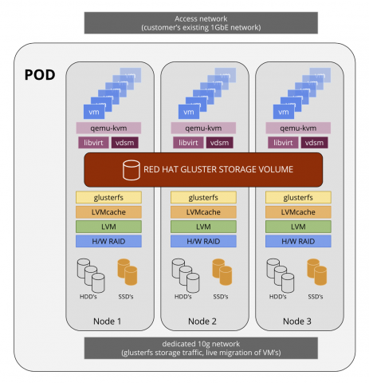
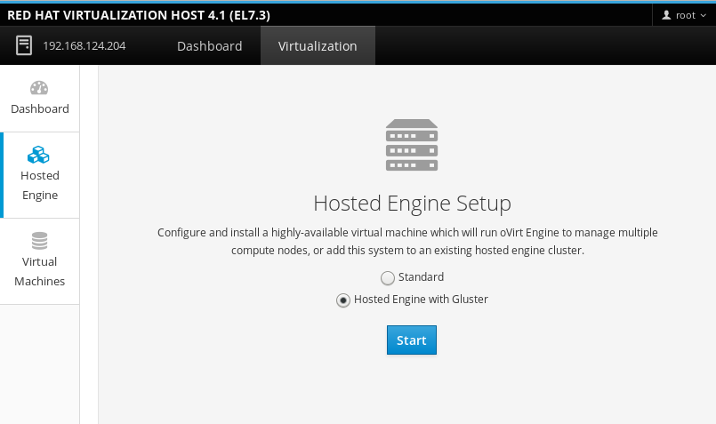
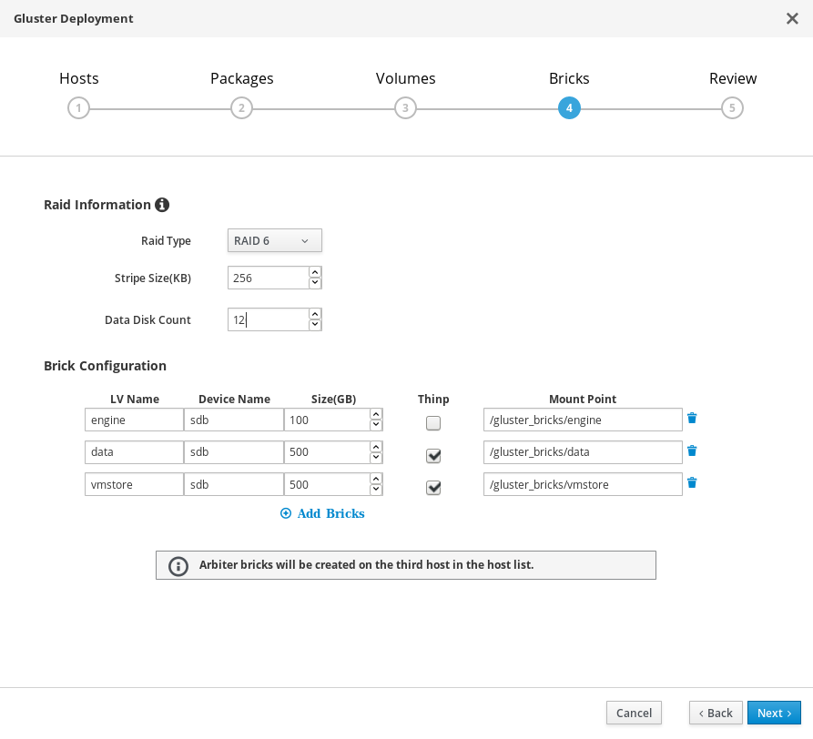
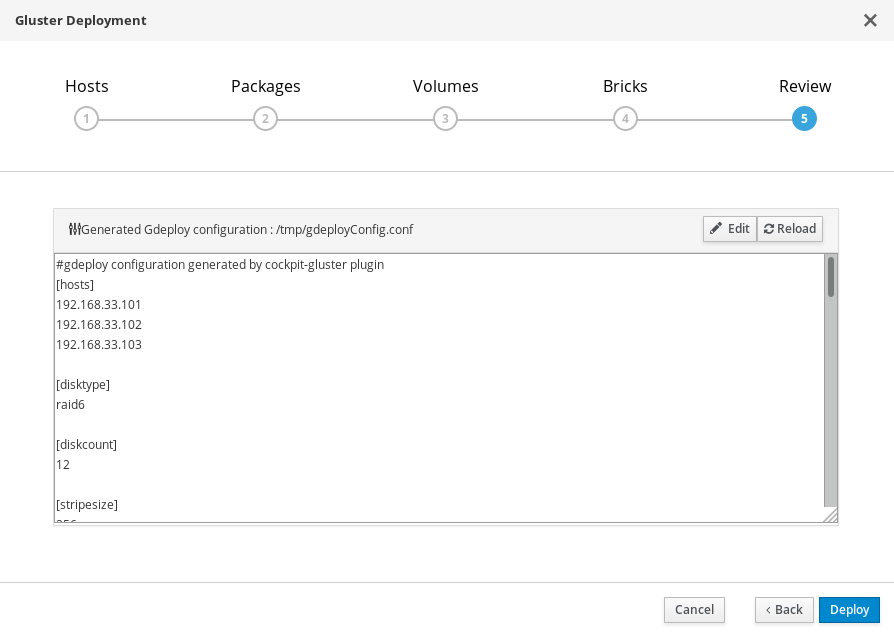
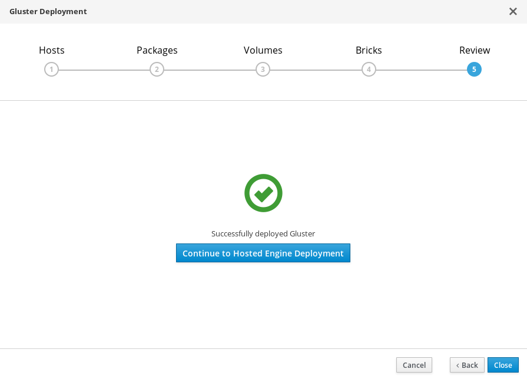
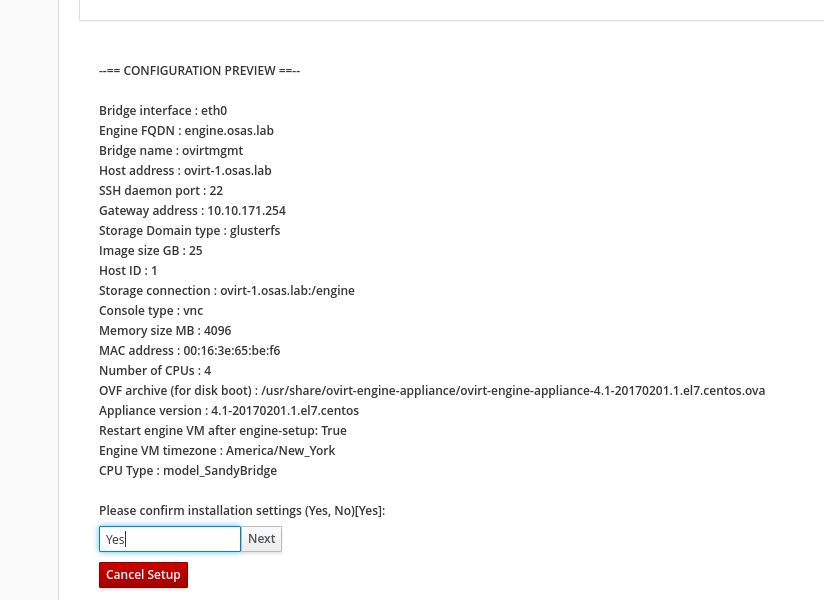

# RHEV Notes

RHEV Is Red Hat's Virtualization platform. It's comparable to VMWare.

* [Red Hat Hyperconverged Infrastructure](#rhhi-notes)
* [Create RHEL Template](#create-rhel-template)
* [P2V Migration](#p2v-migration)
* [Manual P2V](#manual-p2v)
* [RHEVM CLI](#rhevm-cli)
* [Misc RHEVM Notes](#misc-rhevm-notes)
* [RHEVM REST API](#rhevm-rest-api)
* [Dell iDrac Info](#dell-idrac-info)
* [Ansible Automation](#ansible-playbook)

## RHHI Notes

Red Hat Hyperconverged Infrastructure (RHHI) combines compute, storage, networking, and management capabilities in one deployment. In short this makes it to where the Hypervisors are actually running the storage as well. The design looks like this.



The prereqs are as follows:

* 3 Servers able to do virt
* Each server must have at LEAST 2 NICs (one for vm network and one for storage network)
* Each server must have at LEAST 2 Hard Drives (one for the Hypervisor OS and the other for Gluster)
* 12 Core CPU
* 64GB of RAM

The following steps will get you up and running.

* [Prepare The Hosts](#prepare-the-hosts)
* [Deploy Gluster Storage](#deploy-gluster-storage)
* [Deploy SelfHosted Engine](#deploy-selfhosted-engine)
* [Configure Storge for RHEV](#configure-storge-for-rhev)
* [Configure Hypervisors for RHEV](#configure-hypervisors-for-rhev)

### Prepare the Hosts

I installed `RHEL 7.4` on each one of my hosts with the following repos enabled (ALSO: Make sure that your two nics are connected to their respective networks.)

```
[root@hyperX ~]# yum repolist
Loaded plugins: enabled_repos_upload, package_upload, product-id, search-disabled-repos, subscription-manager, vdsmupgrade
repo id                                                                             repo name                                                                          status
!rh-gluster-3-for-rhel-7-server-rpms                                                rh-gluster-3-for-rhel-7-server-rpms                                                   884
!rhel-7-server-ansible-2-rpms                                                       rhel-7-server-ansible-2-rpms                                                           33
!rhel-7-server-rhv-4-mgmt-agent-rpms                                                rhel-7-server-rhv-4-mgmt-agent-rpms                                                 1,391
!rhel-7-server-rhv-4.2-manager-rpms                                                 rhel-7-server-rhv-4.2-manager-rpms                                                    471
!rhel-7-server-rpms                                                                 rhel-7-server-rpms                                                                 20,920
repolist: 23,699

```


After that I installed the following packages on all servers

```
[root@hyperX ~]# yum -y install glusterfs-server glusterfs-fuse cockpit-bridge cockpit-ovirt-dashboard
```


Next I opened the cockpit ports on all servers

```
[root@hyperX ~]# firewall-cmd --permanent --add-service=cockpit
[root@hyperX ~]# firewall-cmd --reload
```

Now from the "main" server (it doesn't matter which one...I'll use the first one but you can use any one); create and distribute the sshkeys (even to itself).

```
[root@hyper1 ~]# ssh-keygen
[root@hyper1 ~]# for i in {1..3}; do ssh-copy-id hyper$i.cloud.chx ; done
```

I verify with a similar loop (note that I do the same for the storage network as well)

```
[root@hyper1 ~]# for i in {1..3}; do ssh hyper$i.cloud.chx hostname ; done
[root@hyper1 ~]# for i in {1..3}; do ssh-copy-id 172.31.254.25$i ; done
```
### Deploy Gluster Storage

Browse to the Cockpit management interface of the first virtualization host, for example `https://hyper1.example.com:9090/`, and log in as `root`


Start the deployment wizard by clicking `Virtualization > Hosted Engine`, and select `Hosted Engine with Gluster`, and click `Start`.




In the deployment wizard specify storage hosts. Remember Specify the **back-end gluster network addresses** (**__not__** the vm network addresses) of the three virtualization hosts. The host that can SSH using key pairs should be listed first. Click `Next`


On the next page; leave it blank and click `Next`


Next specify the volumes to be created. The default settings should be fine.


Next, it'll ask you to specify the bricks and what the backing RAID system is. If you're using "standalone" disks (i.e. a single disk) just chose `JBOD`. The defaults should be fine after that. Just verify that the device name is right. Here it's `sdb` referencing `/dev/sdb`. (you may want to verify that on each host by doing `fdisk -l`). Again, the defaults were fine for me.



Now you have a chance to edit the `gdeploy` config it creates. I didn't have to but you can if you need/want to. Click `Deploy` when you're ready



You should see this screen when it has finished.



Click on "Continue to Hosted Engine Deployment" when ready

### Deploy SelfHosted Engine

After finishing deploying gluster; you're presented with a screen when you click "Continue to Hosted Engine Deployment" that says:

```
Continuing will configure this host for serving as hypervisor
and create a VM where you have to install the engine afterwards.
Are you sure you want to continue?
```

Agree by typing `Yes` in the provided box.

**NOTE**: I like to run `yum -y install ovirt-hosted-engine-setup` on the host I'm running this one before this step to speed up the installation.

Once you've agreed; it'll ask you questions that you should be able to figure out (like ip address of the engine and storage backend). Here is a review page for reference



If you need help consult the [documentation page](https://access.redhat.com/documentation/en-us/red_hat_hyperconverged_infrastructure/1.0/html/deploying_red_hat_hyperconverged_infrastructure/) or [this blog](https://www.ovirt.org/blog/2017/04/up-and-running-with-ovirt-4.1-and-gluster-storage/)

The install can take a while but when it's done you'll see this page


### Configure Storge for RHEV

Follow these steps to confgure the storage domain for your RHEV cluster.


First Create your storage network

* Log in to the engine (example `https://rhevm.example.com`)

* Browse to the engine and log in using the administrative credentials you configured when you deployed the Hosted Engine using the Cockpit UI.

* Create a logical network for gluster traffic
  * Click the `Networks` tab and then click `New`. The `New Logical Network` wizard appears.
  * On the `General` tab of the wizard, provide a Name for the new logical network, and uncheck the `VM Network checkbox`.
  * On the `Cluster` tab of the wizard, uncheck the `Required` checkbox.
  * Click `OK` to create the new logical network.

* Enable the new logical network for gluster
    * Click the `Networks` tab and select the new logical network.
    * Click the `Clusters` sub-tab and then click `Manage Network`. The `Manage Network` dialogue appears.
    * In the `Manage Network` dialogue, check the `Migration Network` and `Gluster Network` checkboxes.
    * Click `OK` to save.

* Attach the gluster network to the host
    * Click the `Hosts` tab and select the host.
    * Click the `Network Interfaces` subtab and then click `Setup Host Networks`.
    * Drag and drop the newly created network to the correct interface.
    * Ensure that the `Verify connectivity` checkbox is checked.
    * Ensure that the `Save network configuration` checkbox is checked.
    * Click OK to save.

* Verify the health of the network
  * Click the `Hosts` tab and select the host. Click the `Networks` subtab and check the state of the host’s network.

Next create a master domain for storage

* Click the `Storage` tab and then click `New Domain`.
* Select `GlusterFS` as the `Storage Type` and provide a Name for the domain.

* Check the `Use managed gluster volume` option.

* A list of volumes available in the cluster appears.

* Select the `vmstore` volume and add the following to the `Mount Options` box (use your storage network addresses separated by a `:` between each address)

```
backup-volfile-servers=172.31.254.21:172.31.254.22
```

* Click `OK` to save.

### Configure Hypervisors for RHEV

Follow these steps in Red Hat Virtualization Manager for each of the other hosts.

* Click the `Hosts` tab and then click `New` to open the `New Host` dialog.
* Provide a Name, Address, and Password for the new host.
* Uncheck the `Automatically configure host firewall` checkbox, as firewall rules are already configured by `gdeploy`.
* In the `Hosted Engine` tab of the `New Host` dialog, set the value of `Choose hosted engine deployment action` to `deploy`.
* Click `Deploy`.
* Attach the gluster network to the host
  * Click the `Hosts` tab and select the host.
  * Click the `Network Interfaces` subtab and then click `Setup Host Networks`.
  * Drag and drop the newly created network to the correct interface.
  * Ensure that the `Verify connectivity checkbox` is checked.
  * Ensure that the `Save network configuration` checkbox is checked.
  * Click `OK` to save.
* In the `General` subtab for this host, verify that the value of `Hosted Engine HA` is `Active`, with a positive integer as a score.
* Verify the health of the network
  * Click the `Hosts` tab and select the host. Click the `Networks` subtab and check the state of the host’s network.


**NOTE** If the network interface enters an "Out of sync" state or does not have an IPv4 Address, click the Management tab that corresponds to the host and click Refresh Capabilities.

## Create RHEL Template

Once you have installed and configured a RHEL/CentOS (maybe enven Fedora?) Server. You can make it a template so that you can create copies of the same machine.

First mark the server as "unconfigured"

```
root@host# touch /.unconfigured
```

Next remove the SSH keys/fingerprints

```
root@host# rm -rf /etc/ssh/ssh_host_*
```

Now (for ease of use) remove all networking directives. under `/etc/sysconfig/network-scripts/ifcfg-eth0` The file should look something like this afterwards.

```
DEVICE="eth0"
TYPE=Ethernet
NM_CONTROLLED="yes"
ONBOOT=yes
IPV6INIT=no
BOOTPROTO=none
DEFROUTE=yes
IPV4_FAILURE_FATAL=yes
NAME="System eth0"
IPADDR=
PREFIX=24
GATEWAY=
DNS1=
DNS2=
DOMAIN=
```

I like to leave the "MUST SET" settings. Please make note to REMOVE the `HWADDR=` line!

Now make sure you remove the hostname under the `/etc/sysconfig/network` file. It should like something like this.

```
HOSTNAME=
NETWORKING=yes
```

Now in the `/etc/udev/rules.d/70-persistent-net.rules` file remove the `SUBSYSTEM` line (the one containing the `eth0` line). It should look something like this

```
# This file was automatically generated by the /lib/udev/write_net_rules
# program, run by the persistent-net-generator.rules rules file.
#
# You can modify it, as long as you keep each rule on a single
# line, and change only the value of the NAME= key.

# PCI device 0x1af4:0x1000 (virtio-pci)

#
##
```

Now you can shutdown the machine.

```
root@host# shutdown -h now
```

Now in the RHEV-M Web interface; you can make a template using the GUI tools.

### RHEL 7 Temlate

These are ADDITIONAL steps

(RHEL only...not CentOs)

```
yum install initial-setup　
```

```
touch /etc/reconfigSys
```

```
systemctl enable initial-setup-graphical.service
```

OR

```
systemctl enable initial-setup-text.service
```

```
cat /dev/null > /etc/machine-id
```

```
subscription-manager ungregister
subscription-manager remove --all
subscription-manager clean
poweroff
```

## P2V Migration

There is an ISO you can load up on the machine to do this "automatically", more [information can be found here](https://access.redhat.com/knowledge/docs/en-US/Red_Hat_Enterprise_Virtualization/3.1/html/V2V_Guide/P2V_Migration_Moving_workloads_from_Physical_to_Virtual_Machines-Preperation_Before_the_P2V_Migration.html#Preperation_Before_the_P2V_Migration-Install_virt_v2v_on_V2V_host)

Pretty good how to there, here is a sample `/etc/virt-v2v.conf` file that I used

```
<profile name="exampleP2V">
  <method>rhev</method>
  <storage format="raw" allocation="preallocated">
  storage.rhevm.example.com:/vmdata/VMEXPORT
  </storage>
  <network type="default">
  <network type="network" name="MISC_SERVING"/>
  </network>
  </profile>
</virt-v2v>
```

Remember to create the export "storage domain" on RHEV-M server before booting the node from the  `rhel-6.3-p2v.iso` image.

## Manual P2V

In some cases the physical machines will simply won't convert over for whatever reason. In this case we can use a "dump and restore" method.

First you must install the `dump` utility on the server as it's probably not installed (via YUM or RPM).

Things to have

* NFS Server
* Linux Live CD (Pref EL 6+)
* Patience

In this example; the server only has 2 partition. Root and Swap (so change accordingly for servers with multi partitions/discs)

First `dump` (backup) the server

```
root@host# dump 0ufb /path/to/nfs/mount/hostname_bak.dmp 126 /
```

Once this is done; create an "empty" VM (make a VM with an HD big enough but don't install an OS on it). Format it

```
root@host# fdisk /dev/vda
.
.
.
root@host# mkfs.ext3 /dev/vda1
root@host# mkswap /dev/vda2
```

Now `restore` your backup onto the VM

```
root@host# mount.nfs nfs-server:/path/to/export /tmp/backup
root@host# mount /dev/vda1 /tmp/recovery
root@host# cd /tmp/recovery
root@host# restore -rf /path/to/nfs/mount/hostname_bak.dmp -b 126
```

Now you have to install grub...you have to change what "disc" since it has changed.

```
root@host# chroot /tmp/recovery
root@recovery# vi /boot/grub/device.map
               (hd0) /dev/vda
root@recovery# grub-inistall /dev/vda
root@recovery# exit
```


OR/AND from the live CD

```
root@recovery# mount /dev/vda2 /mnt/recovery
root@recovery# mount /dev/vda1 /mnt/recovery/boot
root@recovery# vi /mnt/recovery/boot/grub/device.map
               (hd0) /dev/vda
root@recovery# grub-inistall --root-directory=/mnt/recovery /dev/vda
```


Create a new initrd file since you'll need to load virtualization drivers.

```
root@host# mount --bind /proc /tmp/recovery/proc
root@host# mount --bind /dev /tmp/recovery/dev
root@host# mount --bind /sys /tmp/recovery/sys
root@host# chroot /tmp/recovery
root@recovery# cd /boot
root@recovery# mv initrd-2.6.18-194.26.1.el5.img ,initrd-2.6.18-194.26.1.el5.img
root@recovery# mkinitrd --with virtio_pci --with virtio_blk initrd-2.6.18-194.26.1.el5.img $(uname -r)
```

If `$(uname -r)` isn't working for you; try using the name found by doing

```
root@recovery# ls -1 /lib/modules
2.6.18-194.26.1.el5
```

That's it! You may have to boot into single user mode or do some more editing of files to get it to boot (i.e. `/etc/fstab` )

## RHEVM CLI

Connecting

To connect; you may want to use the "insecure" method if you don't know/have the SSL key.

```
root@rhevm# rhevm-shell --url=rhevm.example.com:8443 --username=admin@internal --password=minus273 --insecure
```

Sending Commands

At the time of this writing; you can only "Pass commands" with a "here" file (basic EOF) syntax

```
root@rhevm# rhevm-shell --url=rhevm.example.com:8443 --username=admin@internal --password=minus273 --insecure  <<-EOF
show vm wolf3
EOF
```

I created a snapshot with this command

```
root@rhevm# rhevm-shell --url=rhevm.example.com:8443 --username=admin@internal --password=minus273 --insecure  <<-EOF
add snapshot --vm-identifier montools2 --description 'Montools2 Snapshot'
EOF
```

## Misc RHEVM Notes


In the future when RHEV-M adds the ability to "hot add" memory - you may need to make the guest "see" the new RAM.

**Note: These instructions work for RHEL and CentOS. Other distributions may be different.**

Run this command to check the state of the memory, looking for memory that appears offline

```
root@host# grep line /sys/devices/system/memory/*/state
```

If memory appears as offline, set it to online with the command:

```
root@host# echo online > /sys/devices/system/memory/memory[number]/state
```

To Add ISOs to ISO Domain

First list what's available

```
root@rhevm# # rhevm-iso-uploader -u admin@internal list
Please provide the REST API password for the admin@internal RHEV-M user (CTRL+D to abort):
ISO Storage Domain Name   | Datacenter                | ISO Domain Status
GLNISO                    | GLN                       | active
```

Then upload to the desired domain

```
root@rhevm# rhevm-iso-uploader -u admin@internal -i GLNISO upload Fedora-18-x86_64-netinst.iso
```

You can add an IPA domain so you can use the usernames for the system

```
root@rhevm# rhevm-manage-domains -action=add -domain=example.com -user=admin@EXAMPLE.COM -provider=IPA -interactive
root@rhevm#  /etc/init.d/ovirt-engine restart
root@rhevm# rhevm-manage-domains -action=list
Domain: example.com
	User name: admin@EXAMPLE.COM
	This domain is a remote domain.
Manage Domains completed successfully
```

Fence RHEV VM

You can "fence" (power plug pull) a RHEV VM from the command line (from any server)

Install Packages
```
root@host# yum -y install fence-agents
```

Fence a server
```
root@host# fence_rhevm -o status -z -a rhevm.example.com -u 8443 -l 'admin@internal' -p 'minus273' -n w1.gln.example.com
```

The `--help` option is good enough to get you going

## RHEVM REST API

Rough Notes

```
Get Cert
----
curl -o rhevm.cer -k https://rhevm.example.com:8443/ca.crt

GET
----
curl -X GET -H "Accept: application/xml" -u "admin@internal:minus273"  --cacert rhevm.cer https://rhevm.example.com:8443/api/networks
curl -X GET -H "Accept: application/xml" -u "admin@internal:minus273"  --cacert rhevm.cer https://rhevm.example.com:8443/api/datacenters
curl -X GET -H "Accept: application/xml" -u "admin@internal:minus273"  --cacert rhevm.cer https://rhevm.example.com:8443/api/clusters


POST
----
curl -X POST -H "Accept: application/xml" -H "Content-Type: application/xml" -u "admin@internal:minus273" --cacert rhevm.cer -d "<action/>" https://rhevm.example.com:8443/api/hosts/b2161c48-eb22-11e1-a715-37256033ccf9/approve

curl -X POST -H "Accept: application/xml" -H "Content-Type: application/xml" -u "admin@internal:minus273" --cacert rhevm.cer -d "<storage_domain><name>data1</name><type>data</type><storage><type>nfs</type><address>192.168.0.10</address><path>/data1</path></storage><host><name>hypervisor</name></host></storage_domain>" https://rhevm.example.com:8443/api/hosts/b2161c48-eb22-11e1-a715-37256033ccf9/approve
^ The API creates a NFS data storage domain called data1 with an export path of 192.168.0.10:/data1 and sets access to the storage domain through the hypervisor host

curl -X POST -H "Accept: application/xml" -H "Content-Type: application/xml" -u "admin@internal:minus273" --cacert rhevm.cer -d "<vm><name>chrishtest</name><cluster><name>VLAN3</name></cluster><template><name>BaseCentOS64_VLAN3</name></template><type>server</type><memory>1073741824</memory><nic><interface>virtio</interface><name>nic1</name></nic></vm>" https://rhevm.example.com:8443/api/vms

curl -X POST -H "Accept: application/xml" -H "Content-Type: application/xml" -u "admin@internal:minus273"  --cacert rhevm.cer -d "<action><vm><os><boot dev='hd' /></os></vm></action>" https://rhevm.example.com:8443/api/vms/ab99b0d0-4893-466e-b0c4-66a09dd627a1/start


DELTE
----
curl -X DELETE -H "Accept: application/xml" -u "admin@internal:minus273"  --cacert rhevm.cer https://rhevm.example.com:8443/api/vms/c745c969-04cd-42a6-99db-b0363fd824b6
^ delete vm
```

## Dell iDrac Info

In RHEV-M, in order to "fence" the device (quickly power it off when a failure happens), you must add a "lights out" management interface on the hypervisor.

Dell has this built in called "iDrac" - but you need to do these in order to get it working you need to enable Telnet (on the web interface) and then run these commands


```
telnet idrac.snipe.example.com
Trying 192.168.3.105...
Connected to idrac.snipe.example.com.
Escape character is '^]'.


rac-7DZJNQ1 login: admin
Password:

Dell Remote Access Controller 5 (DRAC 5)
Firmware Version 1.51 (Build 09.12.11)
Type "racadm help" to get racadm subcommands. Type "smclp" to invoke SMCLP interface.

$ racadm config -g cfgIpmiLan -o cfgIpmiLanEnable 1
Object value modified successfully
$ racadm config -g cfgIpmiLan -o cfgIpmiLanPrivilegeLimit 4
Object value modified successfully
$ racadm config -g cfgIpmiSol -o cfgIpmiSolEnable 1
Object value modified successfully
$ racadm config -g cfgIpmiSol -o cfgIpmiSolMinPrivilege 4
Object value modified successfully
```

Here are the values by themselvs

```
racadm config -g cfgIpmiLan -o cfgIpmiLanEnable 1
racadm config -g cfgIpmiLan -o cfgIpmiLanPrivilegeLimit 4
racadm config -g cfgIpmiSol -o cfgIpmiSolEnable 1
racadm config -g cfgIpmiSol -o cfgIpmiSolMinPrivilege 4
```

## Ansible Playbook

You can create VMs from a playbook. I used the following documentation to help me.

* [Module to manage authentication to oVirt/RHV](https://docs.ansible.com/ansible/2.6/modules/ovirt_auth_module.html)
* [Module to manage Virtual Machines in oVirt/RHV](https://docs.ansible.com/ansible/2.5/modules/ovirt_vms_module.html)
* [Module to manage Virtual Machine and floating disks in oVirt](https://docs.ansible.com/ansible/2.4/ovirt_disk_module.html)

I also needed to install [python-ovirt-engine-sdk4](https://cbs.centos.org/koji/packageinfo?packageID=4119) from the CentOS CBS since it wasn't available in ANY repos I could find.

__Step 1__
You don't need to connect to any "host" so just use `localhost` in your `/etc/ansible/hosts` file like this

```
[vmhost]
localhost ansible_connection=local
```

__Step 2__

I created my playbook like this. Consult the documentation...this is mainly here for "notes"

```yaml
- hosts: all
  tasks:

  - name: Get RHEVM Auth
    ovirt_auth:
      url: https://rhevm.cloud.chx/ovirt-engine/api
      username: admin@internal
      password: "{{ lookup('env','OVIRT_PASSWORD') }}"
      insecure: true
      state: present

  - name: Create VM
    ovirt_vms:
      auth: "{{ ovirt_auth }}"
      name: test1
      state: running
      cluster: Default
      template: rhel-7-template
      memory: 8GiB
      memory_guaranteed: 2GiB
      cpu_threads: 2
      cpu_cores: 2
      cpu_sockets: 1
      type: server
      operating_system: rhel_7x64
      nics:
      - name: nic1
        profile_name: ovirtmgmt
      wait: true

  - name:  Attach additional disk to VM
    ovirt_disk:
      auth: "{{ ovirt_auth }}"
      name: test1-extra-disk
      vm_name: test1
      state: attached
      size: 100GiB
      storage_domain: vmdata
      format: cow
      interface: virtio
      wait: true

##
##
```
__Step 3__

Run your playbook

```
ansible-playbook create_vm.yml
```
